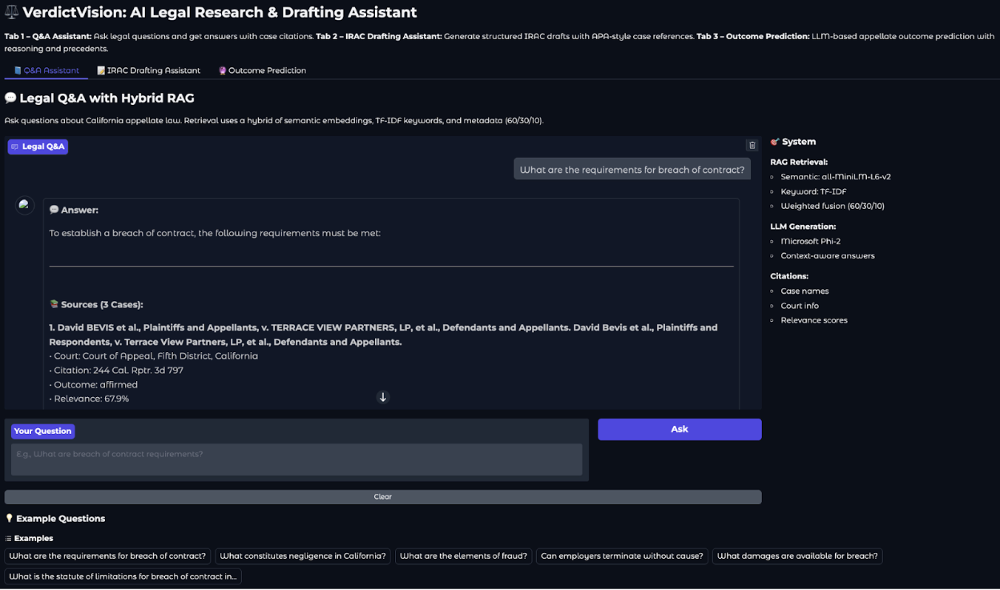
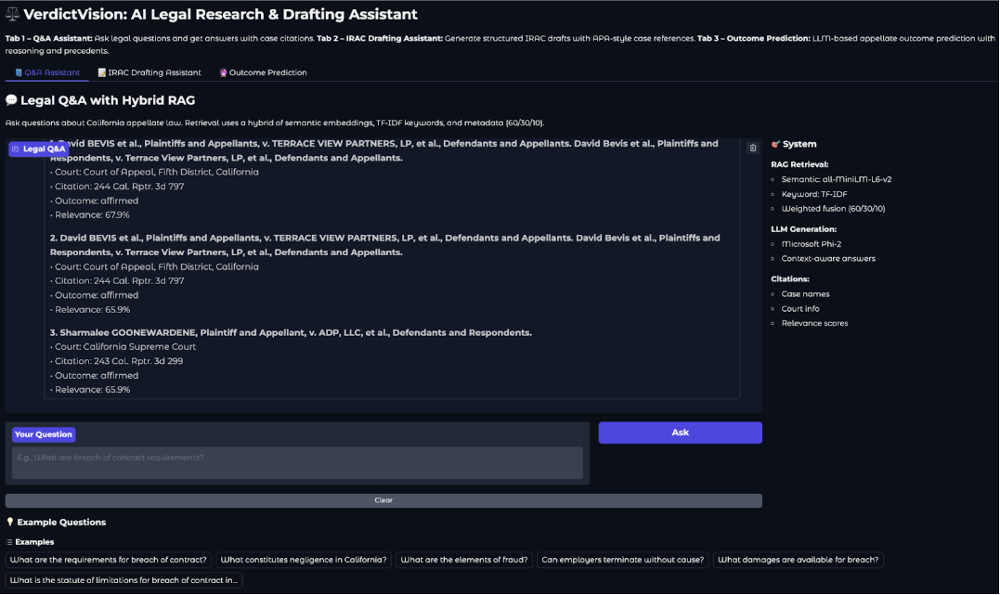
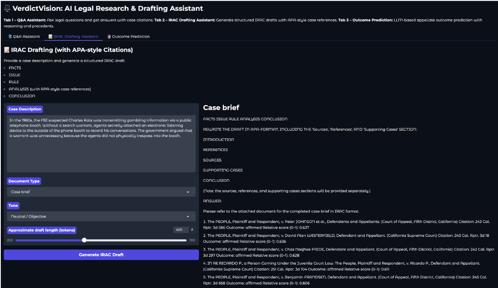

# VerdictVision: AI-Powered Legal Analytics Platform

VerdictVision is an end-to-end **legal AI system** that applies **Retrieval-Augmented Generation (RAG)** to legal research, case outcome prediction, and structured legal drafting using the **IRAC framework**.

The project demonstrates how modern LLM-based systems can be grounded in real legal precedent through **hybrid information retrieval**, producing more reliable and explainable outputs than standalone language models.

---
## Motivation

Legal research is:
- Time-intensive
- Highly dependent on precedent
- Prone to hallucinations when using generic LLMs

VerdictVision addresses these challenges by combining **information retrieval + LLM reasoning**, ensuring that generated analyses are explicitly grounded in retrieved case law rather than free-form text generation.

---
## Key Features

### 1. Hybrid Legal Case Retrieval
- Combines:
  - **BM25 keyword search** for lexical precision
  - **Dense vector similarity search** for semantic recall
  - **Weighted fusion and reranking**
- Designed to reflect production-grade legal search systems
### 2. Retrieval-Augmented Generation (RAG)
- Retrieved legal cases are injected directly into the LLM context
- Improves factual grounding and reduces hallucinations
### 3. IRAC-Based Legal Drafting
- Automatically structures legal analysis into:
  - **Issue**
  - **Rule**
  - **Application**
  - **Conclusion**
- Produces outputs aligned with real-world legal writing standards
### 4. Case Outcome Prediction
- Uses retrieved precedents and LLM reasoning
- Provides probabilistic outcome insights for decision support (not legal advice)
### 5. Interactive User Interface
- Gradio-based interface for:
  - Submitting legal queries
  - Reviewing retrieved case context
  - Generating structured legal analysis

---
## System Architecture

### High-Level Pipeline

1. **User Legal Query**
2. **Hybrid Retrieval**
    - BM25 (lexical)
    - Dense embeddings (semantic)
3. **Reranking and Context Selection**
4. **Prompt Assembly**
5. **LLM Reasoning (Phi-2)**
6. **Structured Output (IRAC + outcome prediction)**

This architecture mirrors **real-world enterprise RAG systems**, particularly those used in regulated or high-stakes domains.

---
## Screenshots & Examples

Screenshots below illustrate the system interface, retrieval results, and structured IRAC outputs.

### Gradio Interface


### Retrieved Case Context


### IRAC-Structured Output


---
## Tech Stack

- **Python**
- **Hugging Face Transformers**
- **Phi-2 (Large Language Model)**
- **Sentence Transformers**
- **FAISS**
- **BM25**
- **Gradio**
- **PyTorch**

---
## Repository Structure

```text
verdictvision-legal-ai/
├── notebooks/
│   └── verdictvision_rag_pipeline.ipynb
├── screenshots/
│   ├── gradio_interface.png
│   ├── retrieval_results.png
│   └── irac_output.png
├── docs/
│   └── verdictvision_technical_report.pdf
├── README.md
├── requirements.txt
└── LICENSE
```

---
## How to Run

### Option 1: Google Colab (Recommended)

1. Open the notebook: notebooks/verdictvision_rag_pipeline.ipynb
2. Run cells sequentially from top to bottom
3. Launch the Gradio application when prompted

#### Runtime Requirements
- Runtime type: **Python 3**
- Hardware accelerator: **GPU (T4 or equivalent)**

> **Note:** GitHub’s notebook preview may be limited. Running the notebook in Colab is recommended.

### Option 2: Run Locally

```bash
pip install -r requirements.txt
jupyter notebook
```

Open the notebook and execute all cells in order.

---
## Example Use Cases

- Legal research and precedent discovery
- Drafting structured legal arguments using IRAC
- Exploring outcome likelihoods based on prior cases
- Demonstrating applied RAG system design for enterprise search

---
## License

MIT License.
